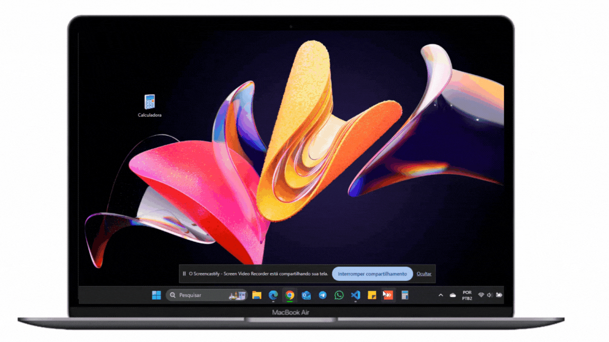

# Projeto CALCULADORA
## Em Python utilizando a biblioteca tkinter 

## Resumo
Este projeto é uma calculadora desenvolvida em Python, utilizando a biblioteca gráfica Tkinter para a interface do usuário. A calculadora é capaz de realizar operações matemáticas básicas como adição, subtração, multiplicação e divisão.

O código foi escrito de maneira clara e eficiente, com funções bem definidas para cada operação. A interface do usuário é intuitiva e fácil de usar, com botões para cada número e operação.

## Tkinter 
É uma biblioteca gráfica para Python que permite a criação de interfaces gráficas de maneira simples e intuitiva1. 

## Instruções para o Executável
O executável do projeto pode ser baixado diretamente do repositório no GitHub. Este arquivo .exe é compatível apenas com o sistema operacional Windows.

Para executar o arquivo, siga estas etapas:
1- Baixe o arquivo .exe do repositório.
2 -Localize o arquivo em seu sistema e clique duas vezes nele para executar.
3 -Se o Windows Defender exibir uma mensagem de permissão, clique em “Mais informações” e depois em “Executar mesmo assim”.

Por favor, note que este arquivo executável foi gerado a partir do código Python original usando uma ferramenta de empacotamento PYISNTALLER. Ele não requer a instalação do Python ou de qualquer biblioteca adicional para ser executado.

## PyInstaller 
É uma ferramenta que empacota um aplicativo Python e todas as suas dependências em um único pacote1. O usuário pode executar o aplicativo empacotado sem precisar instalar um interpretador Python ou quaisquer módulos1.

credito: 
Usando Python https://www.youtube.com/watch?v=i24MxljM-Bw&list=PLGFzROSPU9oVOK_4OojndjJggKV5ef1nQ
